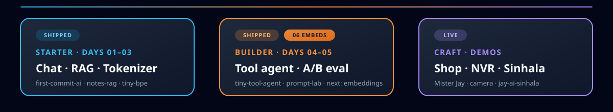

  

  

  
  
  
  
  
  
  
  

# PrimeOdin

> Shop-taught systems. Tools that teach. Code that survives pressure.

I ship **tiny, runnable, tested** public builds so regular people learning AI can enter GitHub the way a shop teaches a craft: show the job, name the hazards, leave clear notes.

  

## Live demos

| Project | What it is | Try it |
| --- | --- | --- |
| **[Mister Jay](https://github.com/primeodin/mister-jay)** | Practice the shop skills Jay taught — vehicle, electrical, plumbing, household. Illustrated Learn/Practice + Shop tip judgment. | [Live](https://primeodin.github.io/mister-jay/) |
| **[jay-ai-sinhala](https://github.com/primeodin/jay-ai-sinhala)** | Jay teaches friends (70+) to build with GitHub + AI — in Sinhala. Literacy before hype. | [Live](https://primeodin.github.io/jay-ai-sinhala/) |
| **[camera-selector](https://github.com/primeodin/camera-selector)** | DIY NVR camera selector + Frigate planning for real budgets and layouts. | [Live](https://primeodin.github.io/camera-selector/) |

## Daily public builds (Karpathy energy, regular-user friendly)

One new **working + tested** public repo most weekdays. Pattern:

1. One idea you can explain in a sentence  
2. `README` that teaches by running  
3. Smoke tests that pass without secrets (mock mode)  
4. Clear “what you learned” notes  

**Roadmap (starter → mid):**

| # | Repo theme | Level | State |
| --- | --- | --- | --- |
| 01 | **[first-commit-ai](https://github.com/primeodin/first-commit-ai)** — chat CLI + mock tests | starter | shipped |
| 02 | **[notes-rag](https://github.com/primeodin/notes-rag)** — retrieve, cite, answer over Markdown notes | starter | shipped |
| 03 | **[tiny-bpe-tokenizer](https://github.com/primeodin/tiny-bpe-tokenizer)** — watch text become token IDs | starter | shipped |
| 04 | Tiny tool-calling agent (ReAct, no framework soup) | mid | queued |
| 05 | Prompt lab — A/B eval harness | mid | queued |
| 06 | Embedding playground (similarity you can see) | starter | queued |
| 07 | Vision caption loop | mid | queued |
| 08 | Local memory scratchpad for agents | mid | queued |
| 09 | Shop-skill explainer tied to Mister Jay drills | craft | queued |

Inspired by the spirit of small teaching repos like [nanoGPT](https://github.com/karpathy/nanoGPT), [micrograd](https://github.com/karpathy/micrograd), [LLMs-from-scratch](https://github.com/rasbt/LLMs-from-scratch), and [ai-agents-from-scratch](https://github.com/pguso/ai-agents-from-scratch) — remixed for people who just opened GitHub.

## Your first pull request starts here

Every teaching repo above keeps a few **`good first issue`** tickets open on purpose — scoped small, with the file to touch named in the ticket. No prior open-source experience needed.

- [All open good first issues across my repos](https://github.com/search?q=user%3Aprimeodin+is%3Aissue+is%3Aopen+label%3A%22good+first+issue%22&type=issues)
- [`notes-rag` #1 — `--json` CLI output for answer + sources](https://github.com/primeodin/notes-rag/issues/1)
- [`tiny-bpe-tokenizer` #2 — unicode/emoji hand-worked merge table](https://github.com/primeodin/tiny-bpe-tokenizer/issues/2)
- [`mister-jay` #1 — add watch-along links to a sketch JSON](https://github.com/primeodin/mister-jay/issues/1)
- [`notes-rag` #3 — CONTRIBUTING.md for first-timers](https://github.com/primeodin/notes-rag/issues/3)

Claim one in a comment, ask questions in the thread, ship it. Docs and diagrams count as real contributions here.

## Archive standouts

Honest reconstructed chapters (2003–2023 arc) — period-aware, meant to be run:

- [runeweaver-c](https://github.com/primeodin/runeweaver-c) · [undying-allocator](https://github.com/primeodin/undying-allocator) · [attention-warrior](https://github.com/primeodin/attention-warrior) · [resilient-kingdom](https://github.com/primeodin/resilient-kingdom) · [primeodin-chronicles](https://github.com/primeodin/primeodin-chronicles)

Map: [primeodin.github.io](https://primeodin.github.io/)

## What I value

- Small runnable examples over grand declarations  
- Honest provenance  
- Teaching as proof of understanding  
- Resilience before ornament  
- Human judgment sets the charter; machines stop at the gates  

## Follow if…

You care about tools that teach, systems that stay clear under pressure, and builders who leave notes the next traveler can run.

Still hungry for the next winter — and the next first commit that sticks.
